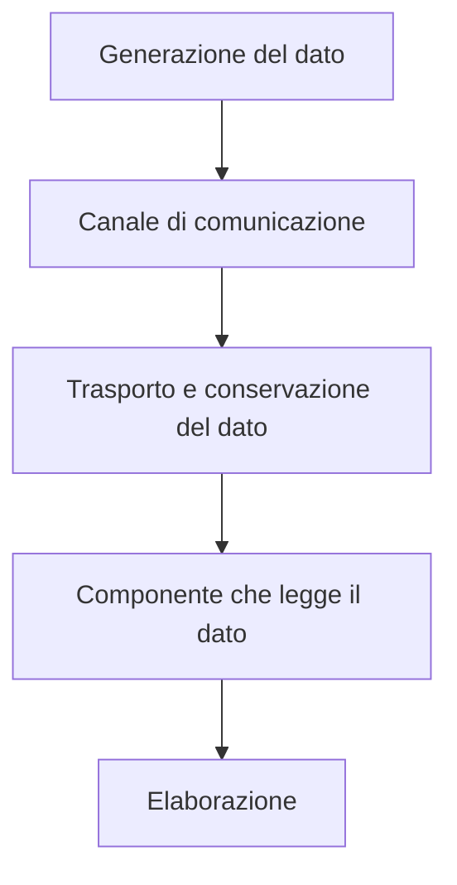
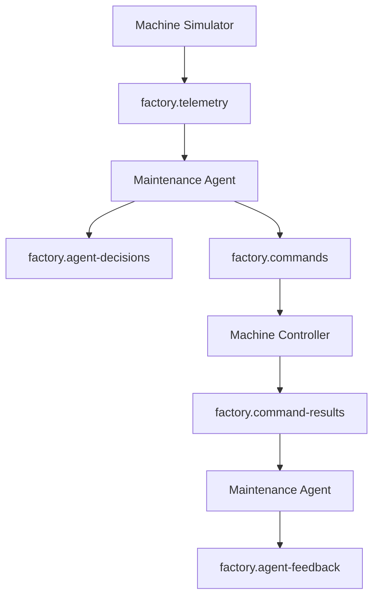

# Agentic Data Plane nella Smart Factory

## Che cos'è un Data Plane

Un **Data Plane** è l'insieme dei componenti e dei meccanismi che permettono ai dati operativi di **attraversare un sistema durante la sua esecuzione**.

Viene spesso chiamato anche **Forwarding Plane** perché si occupa di instradare e movimentare le informazioni da una sorgente a una destinazione.

In un sistema distribuito, il Data Plane gestisce il **flusso concreto delle informazioni tra i diversi servizi**. Non stabilisce necessariamente le regole del sistema, ma permette ai dati di raggiungere tutti i componenti che devono elaborarli.

Il suo funzionamento generale può essere rappresentato così:




---

## Differenza tra Control Plane e Data Plane

Il **Control Plane** e il **Data Plane** svolgono funzioni differenti.

**Control Plane**: definisce configurazioni, regole e politiche. Per esempio, decide quali servizi devono esistere, quali topic devono essere disponibili e quali soglie definiscono un rischio critico.

**Data Plane**: trasporta invece i dati operativi prodotti durante l'esecuzione.

In forma sintetica:

```text
Control Plane
Definisce come il sistema deve funzionare.

Data Plane
Trasporta ciò che accade durante il funzionamento.
```

Il file `compose.yaml` appartiene principalmente alla configurazione del sistema, mentre le comunicazioni che attraversano i topic Redpanda costituiscono invece il Data Plane operativo.

Un esempio di configurazione può essere:

```yaml
STATE_WINDOW_SIZE: "5"
CONTROLLER_MODE: MIXED
```

Questi valori definiscono come devono comportarsi i componenti.

La distinzione può essere riassunta così:

> Le configurazioni del Control Plane stabiliscono come il sistema deve funzionare. Il Data Plane trasporta ciò che accade mentre il sistema è in funzione.

---

## Ruoli principali del Data Plane

 
| Ruoli | Descrizione |
|--------|-------------|
| **Trasporto dei dati** | Permette lo spostamento delle informazioni tra sistemi, applicazioni e servizi. |
| **Elaborazione dei pacchetti** | Analizza e instrada i dati in base alle regole ricevute dal Control Plane. |
| **Applicazione delle politiche** | Può implementare controlli di sicurezza, Quality of Service (QoS) e filtri di accesso ai dati. |
| **Ottimizzazione delle prestazioni** | È progettato per garantire velocità elevate, bassa latenza ed elevata affidabilità durante la trasmissione delle informazioni. |

---

## Perché è utile utilizzare un Data Plane?

L'utilizzo di un Data Plane offre numerosi vantaggi.

- **Separazione delle responsabilità**: Suddivide le decisioni strategiche dalle operazioni esecutive rendendo l'architettura più organizzata e scalabile, infatti il Control Plane decide, mentre il Data Plane esegue.

- **Maggiore efficienza**: poiché è specializzato nella movimentazione dei dati, può essere ottimizzato per prestazioni molto elevate. 

- **Scalabilità**: permette di gestire grandi volumi di traffico senza aumentare eccessivamente la complessità del sistema. 

- **Sicurezza**: consente di applicare regole e controlli sul traffico dati in modo centralizzato e coerente.
---
## Evoluzione del Data Plane

Il concetto di Data Plane nasce nel settore delle **reti di comunicazione** e delle infrastrutture Internet, dove si è consolidato con la diffusione di router, switch e protocolli di routing moderni. Con l'evoluzione del cloud computing e delle architetture Software Defined Networking (SDN), la **separazione tra Control Plane e Data Plane è diventata sempre più importante**.

Oggi il Data Plane continua a evolversi perché:

- i volumi di dati sono in costante crescita;

- le applicazioni distribuite richiedono tempi di risposta sempre più bassi;

- i sistemi di Intelligenza Artificiale necessitano di accesso rapido e controllato ai dati;

- le organizzazioni devono garantire sicurezza e governance sempre più rigorose.

Per questi motivi il Data Plane è ancora un'area attiva di ricerca e sviluppo.

---

## Che cos'è un Agentic Data Plane

Un **Agentic Data Plane** è un'evoluzione del Data Plane progettato per sostenere il ciclo operativo di uno o più **agenti software**.

L'idea fondamentale è che non basta più movimentare i dati: bisogna fornire agli agenti l'accesso sicuro, controllato e contestualizzato alle informazioni e alle azioni che possono eseguire.  

In pratica, un Agentic Data Plane diventa l'infrastruttura che collega:

- agenti AI;

- modelli linguistici (LLM);

- basi di dati;

- applicazioni aziendali;

- strumenti esterni;

- sistemi di monitoraggio e governance.

## Come funziona un Agentic Data Plane?

Un Agentic Data Plane introduce funzionalità aggiuntive rispetto a un Data Plane tradizionale.

| **Caratteristica** | **Descrizione** |
|------------|-----------|
| **Gestione dell'identità** | Ogni agente possiede una propria identità digitale e opera secondo permessi specifici. |
| **Governance** | Ogni azione compiuta dall'agente viene monitorata, registrata e resa verificabile. |
| **Accesso ai dati** | L'agente può interrogare database, documenti e sistemi aziendali in modo controllato. |
| **Integrazione con strumenti** | Può utilizzare API, servizi cloud, workflow aziendali e altre applicazioni per completare i propri compiti. |
| **Osservabilità** | Tutte le operazioni vengono registrate per facilitare audit, debugging e controllo dei costi. |


---
## Differenze tra Data Plane e Agentic Data Plane

| Data Plane Tradizionale | Agentic Data Plane |
|-------------------------|-------------------|
| Trasporta ed elabora dati | Coordina dati, strumenti e agenti AI |
| Lavora su flussi di rete | Lavora su flussi decisionali e operativi |
| Segue istruzioni del Control Plane | Supporta agenti autonomi che prendono decisioni |
| Focus sulle prestazioni | Focus su prestazioni, governance e autonomia |
| Gestisce traffico dati | Gestisce dati, strumenti, permessi e azioni degli agenti |


## L'Agentic Data Plane realizzato nel progetto

Nel progetto, il Data Plane è formato da:

- Redpanda come broker centrale;
- i topic applicativi;
- le partizioni;
- le chiavi dei record;
- gli offset;
- i producer;
- i consumer;
- i consumer group;
- gli eventi JSON scambiati tra i servizi.

Redpanda è quindi il **broker di event streaming che costituisce il cuore infrastrutturale del Data Plane**, ma non coincide da solo con l'intero Data Plane.

Il Data Plane completo comprende anche i componenti che producono e consumano gli eventi.


---

## Perchè inserire un Broker nel Data Plane

Un Data Plane può funzionare perfettamente senza alcun message broker. Infatti è possibile utilizzare un `API Rest` oppure una `ETL Pipeline` che si frappone tra il producer e il consumer.

Tuttavia, nelle moderne architetture distribuite e negli Agentic Data Plane, **broker** ed event streaming platform sono spesso utilizzati per facilitare:
- la comunicazione asincrona;
- la scalabilità;
- il disaccoppiamento tra sistemi e agenti;
- persistenza degli eventi.

-----

<!--
## Percezione dell'ambiente

La prima funzione dell'agentic data plane è trasportare le informazioni che descrivono lo stato dell'ambiente.

Nel progetto, il `Machine Simulator` genera una telemetria simile a:

```json
{
  "event_id": "uuid-evento",
  "correlation_id": "abc-125",
  "machine_id": "machine-01",
  "temperature": 93.94,
  "vibration": 6.82,
  "speed": 1450,
  "energy_consumption": 128.0,
  "phase": "DEGRADING"
}
```

L'evento viene pubblicato su:

```text
factory.telemetry
```

Il `Maintenance Agent` è configurato per controllare e leggere i messaggi disponibili nel topic della telemetria (legge i messagi anche dal topic `factory.command_results` per produrre dei feedback).

```python
consumer.subscribe(
    [
        TELEMETRY_TOPIC,
        COMMAND_RESULTS_TOPIC,
    ]
)
```

Per l'agente, ogni evento di telemetria rappresenta una nuova osservazione della macchina, per questa presenta tanti eventi quanto sono quelli riportati nel topic che salva la telemetria.

```text
Machine Simulator
        ↓
genera una misurazione
        ↓
factory.telemetry
        ↓
Maintenance Agent
        ↓
aggiorna la memoria
```

---

## Decisione dell'agente

Dopo aver ricevuto la telemetria, il Maintenance Agent:

1. aggiorna la memoria della macchina;
2. calcola le medie recenti;
3. verifica il trend;
4. calcola il `risk_score`;
5. seleziona un'azione.

Ogni valutazione viene pubblicata su:

```text
factory.agent-decisions
```

Un evento può contenere:

```json
{
  "correlation_id": "abc-125",
  "risk_score": 0.56,
  "previous_action": "MONITOR",
  "selected_action": "REDUCE_SPEED",
  "reason": "The risk level requires a speed reduction"
}
```

La decisione è parte del data plane perché viene prodotta durante l'esecuzione e resa disponibile come evento persistente.

---

## Comandi operativi

Non tutte le decisioni richiedono l'intervento del Controller.

```text
NO_ACTION
→ nessun comando

MONITOR
→ nessun comando

REDUCE_SPEED
→ comando

REQUEST_INSPECTION
→ comando

EMERGENCY_STOP
→ comando
```

Le azioni operative vengono pubblicate su `factory.commands`, in modo tale che il `Machine Controller` può leggere gli eventi da questo topic e simula l'esecuzione delle azioni.

La separazione tra decisione e comando permette di distinguere:

```text
factory.agent-decisions
Che cosa ha deciso l'agente.

factory.commands
Che cosa deve essere realmente eseguito.
```

---

## Risultati delle azioni

Dopo aver elaborato un comando, il Machine Controller pubblica il risultato su:

```text
factory.command-results
```

Un risultato positivo può essere:

```json
{
  "correlation_id": "abc-125",
  "action": "REDUCE_SPEED",
  "result": "SUCCESS",
  "machine_status": "REDUCED_SPEED",
  "previous_speed": 1400,
  "current_speed": 900
}
```

Un risultato negativo può essere:

```json
{
  "correlation_id": "abc-127",
  "action": "EMERGENCY_STOP",
  "result": "FAILED",
  "failure_reason": "Simulated actuator communication failure",
  "machine_status": "RUNNING"
}
```

Il risultato permette di distinguere tra azione richiesta e azione realmente eseguita.

---

## Ciclo di feedback

Il ciclo agentico non termina quando il Maintenance Agent pubblica il comando, infatti l'agente deve sapere se l'azione richiesta ha avuto successo oppure è fallita.

Per questo il Maintenance Agent legge anche:

```text
factory.command-results
```

Quando riceve il risultato, aggiorna il proprio stato interno:

```python
state.update_command_result(command_result)
```

Successivamente pubblica un feedback su:

```text
factory.agent-feedback
```

Un feedback può contenere:

```json
{
  "correlation_id": "abc-127",
  "action": "EMERGENCY_STOP",
  "command_result": "FAILED",
  "machine_status": "RUNNING",
  "feedback_status": "PROCESSED"
}
```

È importante distinguere i due campi:

```text
command_result = FAILED
Il Controller non è riuscito a eseguire il comando.

feedback_status = PROCESSED
L'agente ha ricevuto e interpretato correttamente il risultato negativo.
```

Il feedback chiude il ciclo:

```text
Percezione
        ↓
Decisione
        ↓
Azione
        ↓
Risultato
        ↓
Feedback
```
-->
---
## Comunicazione asincrona

L'Agentic Data Plane, posto alla base dell'architettura del progetto, ha il compito di disaccoppiare le diverse componenti del sistema, evitando comunicazioni dirette tra di esse.

Ad esempio, il **Machine Simulator**, che genera i dati telemetrici della macchina, non invia richieste HTTP direttamente al **Maintenance Agent**. Allo stesso modo, il **Maintenance Agent**, dopo aver analizzato i dati e aver preso una decisione, non comunica direttamente con il **Machine Controller** per impartire le azioni correttive.

Tutte le interazioni avvengono attraverso l'Agentic Data Plane, che funge da livello intermedio di comunicazione e coordinamento.


```text
Comunicazione diretta:
Simulator → Agent → Controller
```

```text
Comunicazione asincrona:
Simulator → topic → Agent → topic → Controller
```

Questo disaccoppiamento permette ai componenti di:

- funzionare con velocità differenti;
- essere riavviati separatamente;
- essere sostituiti senza cambiare gli altri servizi;
- rileggere eventi ancora disponibili;
- essere osservati tramite topic e log.

<!--
## Persistenza e recupero

Gli eventi non scompaiono subito dopo la lettura, perché Redpanda li conserva secondo la configurazione del broker e dei topic.

Questa proprietà permette a un consumer temporaneamente arrestato di **recuperare gli eventi dopo il riavvio**.

Esempio:

```text
Maintenance Agent arrestato
        ↓
il simulatore pubblica una telemetria
        ↓
Redpanda conserva l'evento
        ↓
il Maintenance Agent viene riavviato
        ↓
riprende dalla posizione registrata
        ↓
elabora la telemetria
```

Gli offset e i consumer group permettono di registrare l'avanzamento dei consumer.

I dettagli tecnici relativi a partizioni, offset, consumer group e volume persistente sono descritti nel documento `05-redpanda.md`.

---

## Tracciabilità end-to-end

Gli offset identificano la posizione dei record all'interno delle singole partizioni, ma non collegano automaticamente record presenti in topic differenti.

Il progetto usa quindi il campo:

```text
correlation_id
```

Lo stesso valore viene propagato lungo tutta la catena:

```text
factory.telemetry
        ↓
factory.agent-decisions
        ↓
factory.commands
        ↓
factory.command-results
        ↓
factory.agent-feedback
```

Per esempio, cercando:

```text
abc-125
```

è possibile ricostruire:

1. quale telemetria è stata ricevuta;
2. quale rischio è stato calcolato;
3. quale decisione è stata presa;
4. quale comando è stato inviato;
5. quale risultato è stato prodotto;
6. quale feedback è stato acquisito.

Questa caratteristica rende il data plane auditabile e osservabile.

---

## Relazione tra eventi e topic

Il numero di record non deve essere uguale in tutti i topic.

Un esempio è:

```text
5 telemetrie
        ↓
5 decisioni
        ↓
3 comandi
        ↓
3 risultati
        ↓
3 feedback
```

La differenza dipende dalla logica dell'agente:

```text
NO_ACTION e MONITOR
Non richiedono l'intervento del Controller.

REDUCE_SPEED, REQUEST_INSPECTION ed EMERGENCY_STOP
Producono un comando e, successivamente, un risultato e un feedback.
```

Il data plane non copia semplicemente ogni messaggio in tutti i topic. Trasporta eventi derivati sulla base delle decisioni applicative.

---

## Separazione delle responsabilità

Ogni componente mantiene una responsabilità precisa.

```text
Machine Simulator
Produce osservazioni dell'ambiente.

Maintenance Agent
Interpreta le osservazioni e prende decisioni.

Machine Controller
Esegue i comandi simulati.

Redpanda
Riceve, conserva e distribuisce gli eventi.

Agentic Data Plane
È l'insieme del flusso operativo che collega questi componenti.
```

Redpanda non calcola il rischio. Il Maintenance Agent non conserva direttamente i messaggi per gli altri servizi. Il Machine Controller non decide autonomamente quale azione sia necessaria.

Questa separazione rende l'architettura modulare e comprensibile.
-->
---

## Adattamento del Data Plane al comportamento agentico

Nel progetto, un normale flusso di eventi è stato adattato alle necessità di un agente attraverso quattro scelte.

### 1. Memoria dell'agente

Il Maintenance Agent conserva una finestra delle misurazioni recenti invece di reagire soltanto all'ultimo evento.

### 2. Decisioni persistenti

Ogni valutazione viene pubblicata in `factory.agent-decisions`, comprese `NO_ACTION` e `MONITOR`.

### 3. Separazione tra decisione ed esecuzione

L'agente pubblica un comando, mentre il Machine Controller ne simula l'esecuzione.

### 4. Feedback osservabile

Il risultato ritorna all'agente e viene registrato in `factory.agent-feedback`.

Queste caratteristiche trasformano una semplice pipeline di telemetria in un Agentic Data Plane.

---

## Riferimenti

- Redpanda Documentation, Introduction to Redpanda: <https://docs.redpanda.com/streaming/current/get-started/intro-to-events/>
- Redpanda Documentation, How Redpanda Works: <https://docs.redpanda.com/streaming/current/get-started/architecture/>
- Redpanda Documentation, Consumer Offsets: <https://docs.redpanda.com/streaming/current/develop/consume-data/consumer-offsets/>
