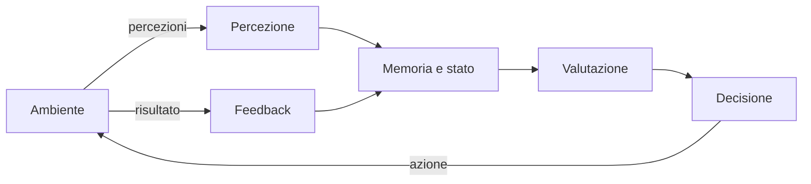
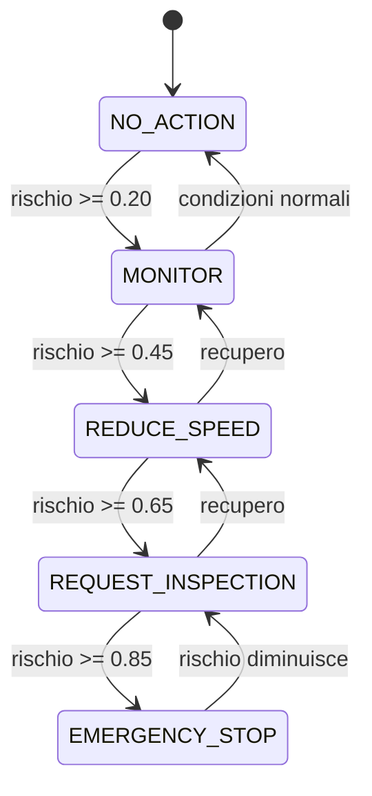
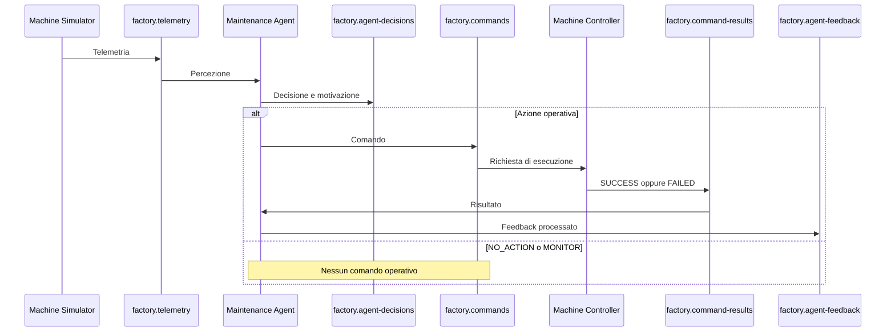
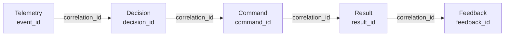

# Agenti software nella Smart Factory

## Obiettivi del capitolo

Questo capitolo descrive:

- che cos'è un agente software;
- quali componenti rendono un sistema agentico;
- la differenza tra agente, semplice consumer e controller;
- come il `Maintenance Agent` del progetto percepisce, memorizza, valuta, decide, agisce e acquisisce feedback;
- come gli identificativi permettono di ricostruire una decisione lungo tutti i topic Redpanda;
- quali sono i limiti del prototipo e i possibili sviluppi futuri.

> **Idea chiave:** un agente non si limita a trasferire dati. Osserva un ambiente, mantiene uno stato, applica una politica decisionale, produce azioni e usa il risultato delle azioni come feedback.

---

## 1. Che cos'è un agente

Un **agente software** è un sistema che riceve informazioni da un ambiente, le interpreta rispetto a un obiettivo e sceglie un'azione. Un agente può funzionare con regole deterministiche, modelli statistici, tecniche di machine learning oppure modelli linguistici. Un LLM non è quindi un requisito obbligatorio.

Le architetture agentiche possono includere percezione, elaborazione, decisione, azione, memoria e feedback. La memoria permette di conservare il contesto e di non trattare ogni input come un evento completamente isolato. [IBM, Components of AI Agents](https://www.ibm.com/think/topics/components-of-ai-agents) e [Microsoft, Memory for AI Agents](https://microsoft.github.io/ai-agents-for-beginners/13-agent-memory/) descrivono questi elementi come componenti centrali dei sistemi agentici.

### 1.1 Modello generale



GitHub visualizza i diagrammi Mermaid direttamente nei file Markdown, quindi il diagramma rimane modificabile insieme al codice sorgente. [GitHub Docs, Creating diagrams](https://docs.github.com/en/get-started/writing-on-github/working-with-advanced-formatting/creating-diagrams)

---

## 2. Componenti fondamentali di un agente

| Componente | Domanda | Implementazione nel progetto |
|---|---|---|
| Percezione | Che cosa sta accadendo? | Consumo di `factory.telemetry` |
| Memoria | Che cosa è accaduto di recente? | `MachineState` con finestre di temperatura e vibrazione |
| Valutazione | Quanto è rischiosa la situazione? | `risk_engine.py` |
| Decisione | Quale comportamento è opportuno? | `policy.py` |
| Azione | Quale comando deve essere eseguito? | Pubblicazione su `factory.commands` |
| Feedback | L'azione è stata eseguita? | Consumo di `factory.command-results` |
| Audit | Come ricostruisco il processo? | `factory.agent-decisions`, `factory.agent-feedback` e `correlation_id` |

### 2.1 Percezione

La percezione è il punto di ingresso dell'agente. Nel progetto, il `Machine Simulator` pubblica misurazioni strutturate:

```json
{
  "event_id": "uuid-evento",
  "correlation_id": "abc-125",
  "machine_id": "machine-01",
  "temperature": 93.94,
  "vibration": 6.82,
  "speed": 1450,
  "energy_consumption": 128.0,
  "phase": "DEGRADING"
}
```

Il `Maintenance Agent` si iscrive al topic di telemetria:

```python
consumer.subscribe(
    [
        TELEMETRY_TOPIC,
        COMMAND_RESULTS_TOPIC,
    ]
)
```

L'agente non legge soltanto sensori fisici. In un sistema event-driven, un topic può costituire l'interfaccia percettiva dell'agente.

### 2.2 Memoria e stato interno

Un consumer privo di memoria potrebbe reagire soltanto al valore corrente. Il progetto conserva invece una finestra delle ultime misurazioni:

```python
@dataclass
class MachineState:
    machine_id: str
    window_size: int
    temperatures: deque[float] = field(init=False)
    vibrations: deque[float] = field(init=False)
    last_action: str = "NO_ACTION"
```

Le code hanno dimensione massima configurabile:

```python
self.temperatures = deque(maxlen=self.window_size)
self.vibrations = deque(maxlen=self.window_size)
```

Questa è una forma di **memoria a breve termine**. Consente di calcolare medie e trend recenti senza conservare indefinitamente tutti gli eventi. La memoria agentica serve proprio a mantenere contesto, ricordare azioni precedenti e utilizzare risultati passati nelle valutazioni successive. [IBM, What is AI agent memory?](https://www.ibm.com/think/topics/ai-agent-memory)

### 2.3 Valutazione del rischio

Il file `risk_engine.py` trasforma lo stato della macchina in un punteggio compreso tra `0.0` e `1.0`:

```python
total_risk = (
    temperature_risk * TEMPERATURE_WEIGHT
    + vibration_risk * VIBRATION_WEIGHT
    + trend_risk * TREND_WEIGHT
)

return round(min(total_risk, 1.0), 2)
```

Nel prototipo i pesi sono:

```text
Temperatura: 45%
Vibrazione:  45%
Trend:       10%
```

Il punteggio non rappresenta una probabilità scientificamente calibrata di guasto. È un indice deterministico, progettato per rendere osservabile il processo decisionale.

### 2.4 Politica decisionale

Il file `policy.py` converte il rischio in un'azione:

```python
def select_action(risk_score: float) -> str:
    if risk_score >= 0.85:
        return EMERGENCY_STOP

    if risk_score >= 0.65:
        return REQUEST_INSPECTION

    if risk_score >= 0.45:
        return REDUCE_SPEED

    if risk_score >= 0.20:
        return MONITOR

    return NO_ACTION
```

| Intervallo del rischio | Decisione | Effetto operativo |
|---|---|---|
| `< 0.20` | `NO_ACTION` | Nessun comando |
| `0.20 - 0.44` | `MONITOR` | Osservazione più attenta |
| `0.45 - 0.64` | `REDUCE_SPEED` | Comando al controller |
| `0.65 - 0.84` | `REQUEST_INSPECTION` | Richiesta di manutenzione |
| `>= 0.85` | `EMERGENCY_STOP` | Arresto di emergenza |

Separare il calcolo del rischio dalla politica rende il sistema più leggibile e testabile. Le soglie possono cambiare senza riscrivere l'acquisizione degli eventi.

---

## 3. Perché il Maintenance Agent è un agente

Il `Maintenance Agent` non è un semplice inoltro di messaggi perché:

1. percepisce telemetria da un ambiente esterno;
2. conserva misurazioni precedenti;
3. calcola uno stato sintetico di rischio;
4. sceglie tra più azioni possibili;
5. spiega la decisione;
6. evita comandi operativi duplicati;
7. riceve l'esito delle azioni;
8. aggiorna lo stato interno dopo il feedback.



### 3.1 Deduplicazione dei comandi

L'agente registra ogni decisione nell'audit, ma non invia ripetutamente lo stesso comando:

```python
def should_publish_command(
    action: str,
    previous_action: str,
) -> bool:
    requires_intervention = action not in {
        NO_ACTION,
        MONITOR,
    }

    action_has_changed = action != previous_action

    return requires_intervention and action_has_changed
```

La distinzione è:

- `factory.agent-decisions` conserva ogni valutazione;
- `factory.commands` contiene soltanto nuove azioni operative.

### 3.2 `previous_action` e `selected_action`

```json
{
  "previous_action": "MONITOR",
  "selected_action": "REDUCE_SPEED",
  "risk_score": 0.56
}
```

- `previous_action` è l'azione memorizzata prima dell'evento corrente;
- `selected_action` è la nuova decisione prodotta dopo l'aggiornamento dello stato.

Il campo da osservare per sapere che cosa ha deciso l'agente **adesso** è `selected_action`. Il confronto tra i due campi descrive la transizione decisionale.

---

## 4. Decisione, comando, risultato e feedback

Questi concetti sono distinti.

| Elemento | Significato | Topic |
|---|---|---|
| Decisione | Valutazione dell'agente | `factory.agent-decisions` |
| Comando | Azione operativa richiesta | `factory.commands` |
| Risultato | Esito tecnico prodotto dal controller | `factory.command-results` |
| Feedback | Conferma che l'agente ha acquisito l'esito | `factory.agent-feedback` |



### 4.1 Feedback positivo

```json
{
  "correlation_id": "abc-131",
  "action": "REQUEST_INSPECTION",
  "command_result": "SUCCESS",
  "machine_status": "INSPECTION_REQUIRED",
  "feedback_status": "PROCESSED"
}
```

### 4.2 Feedback negativo

```json
{
  "correlation_id": "abc-130",
  "action": "REDUCE_SPEED",
  "command_result": "FAILED",
  "machine_status": "RUNNING",
  "feedback_status": "PROCESSED"
}
```

`FAILED` e `PROCESSED` non sono in contraddizione:

- `command_result = FAILED` indica che il controller non ha applicato l'azione;
- `feedback_status = PROCESSED` indica che l'agente ha ricevuto e registrato correttamente il fallimento.

Senza feedback, l'agente conoscerebbe soltanto l'intenzione di agire. Con il feedback, l'agente può distinguere tra comando inviato e cambiamento realmente applicato.

---

## 5. Tracciabilità end-to-end

Il progetto utilizza più identificativi con responsabilità diverse.

| Campo | Responsabilità |
|---|---|
| `event_id` | Identifica la telemetria |
| `decision_id` | Identifica la decisione |
| `command_id` | Identifica il comando |
| `result_id` | Identifica il risultato |
| `feedback_id` | Identifica il feedback |
| `correlation_id` | Collega l'intera catena |
| `sequence_number` | Ordina gli eventi nella singola simulazione |



Esempio di ricerca:

```text
correlation_id = abc-130
```

La stessa correlazione permette di trovare:

```text
factory.telemetry
→ misurazioni che hanno originato il caso

factory.agent-decisions
→ rischio e azione selezionata

factory.commands
→ comando inviato

factory.command-results
→ esito tecnico

factory.agent-feedback
→ esito acquisito dall'agente
```

---

## 6. Differenza tra i componenti del progetto

### Machine Simulator

- rappresenta il macchinario;
- produce temperatura, vibrazione, velocità e consumo;
- non calcola il rischio;
- non decide azioni.

### Maintenance Agent

- percepisce la telemetria;
- conserva memoria recente;
- calcola il rischio;
- sceglie un'azione;
- pubblica comandi;
- acquisisce il feedback.

### Machine Controller

- non valuta la telemetria;
- non decide quale azione sia migliore;
- riceve un comando già scelto;
- simula l'esecuzione;
- pubblica `SUCCESS` oppure `FAILED`.

### Redpanda

- disaccoppia producer e consumer;
- conserva gli eventi;
- consente ai componenti di funzionare in modo asincrono;
- mantiene offset e consumer group;
- rende osservabile e ricostruibile il flusso.

---

## 7. Il ruolo dell'autonomia

L'autonomia del prototipo è limitata ma concreta. Dopo l'avvio, il sistema non richiede una decisione umana per ogni telemetria. Il comportamento deriva da:

```text
stato recente + rischio + policy
```

L'agente può quindi selezionare autonomamente una delle cinque azioni disponibili. L'autonomia è però vincolata da regole definite dallo sviluppatore, che rendono il comportamento prevedibile e verificabile.

Questa scelta è adatta a una Smart Factory didattica perché privilegia:

- trasparenza;
- determinismo;
- auditabilità;
- facilità di test;
- sicurezza delle azioni.

L'architettura segue inoltre il principio di utilizzare il livello minimo di complessità capace di soddisfare il requisito, evitando di introdurre un modello AI quando regole esplicite sono sufficienti e più controllabili. [Microsoft, AI Agent Orchestration Patterns](https://learn.microsoft.com/en-us/azure/architecture/ai-ml/guide/ai-agent-design-patterns)

---

## 8. Reattività e proattività

Il `Maintenance Agent` è principalmente **reattivo**:

```text
riceve una telemetria
→ aggiorna lo stato
→ calcola il rischio
→ reagisce
```

Possiede però una componente più evoluta rispetto a una semplice regola istantanea, perché utilizza:

- una finestra temporale;
- medie recenti;
- trend crescenti;
- ultima azione;
- feedback del controller.

Non è ancora pienamente proattivo: non formula piani a lungo termine e non programma autonomamente interventi futuri.

---

## 9. Limiti del prototipo

1. **Stato volatile:** la memoria in `MachineState` viene persa quando il container viene ricreato.
2. **Soglie didattiche:** pesi e soglie non derivano da dati industriali reali.
3. **Un solo macchinario:** la struttura supporta più `machine_id`, ma la demo usa `machine-01`.
4. **Controller simulato:** nessun attuatore fisico viene comandato.
5. **Fallimenti controllati:** la modalità `MIXED` produce guasti artificiali per testare i feedback negativi.
6. **Nessun piano di escalation:** un comando fallito viene registrato, ma non genera ancora automaticamente un nuovo piano.
7. **Nessun apprendimento online:** la policy non modifica autonomamente le proprie soglie.

---

## 10. Sviluppi futuri

- persistere lo stato dell'agente;
- gestire più macchine e più agenti;
- introdurre retry ed escalation dopo un fallimento;
- pubblicare eventi non validi in un dead-letter topic;
- aggiungere test automatici per rischio, policy e stato;
- usare dati storici per calibrare le soglie;
- introdurre previsioni di manutenzione;
- aggiungere un human-in-the-loop per le azioni critiche;
- confrontare una policy deterministica con un modello ML;
- misurare latenza end-to-end, throughput e recovery time.

---

## 11. Sintesi

Il progetto implementa un agente deterministico event-driven:

```text
Percezione
factory.telemetry

Memoria
MachineState

Valutazione
risk_engine.py

Decisione
policy.py e factory.agent-decisions

Azione
factory.commands

Esecuzione
Machine Controller

Risultato
factory.command-results

Feedback
factory.agent-feedback
```

Il valore principale dell'architettura non consiste soltanto nel calcolo del rischio. Consiste nella capacità di collegare percezione, decisione, azione e feedback tramite eventi persistenti, identificatori e componenti indipendenti.

---

## Riferimenti

- IBM, [What are the components of AI agents?](https://www.ibm.com/think/topics/components-of-ai-agents)
- IBM, [What is AI agent memory?](https://www.ibm.com/think/topics/ai-agent-memory)
- Microsoft, [Memory for AI Agents](https://microsoft.github.io/ai-agents-for-beginners/13-agent-memory/)
- Microsoft Learn, [AI Agent Orchestration Patterns](https://learn.microsoft.com/en-us/azure/architecture/ai-ml/guide/ai-agent-design-patterns)
- GitHub Docs, [Creating diagrams](https://docs.github.com/en/get-started/writing-on-github/working-with-advanced-formatting/creating-diagrams)
